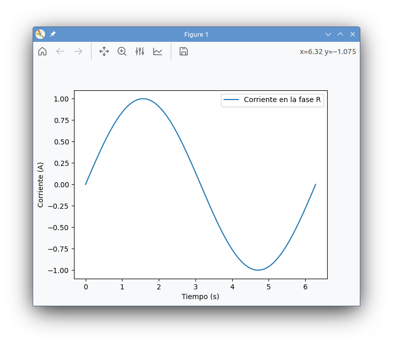
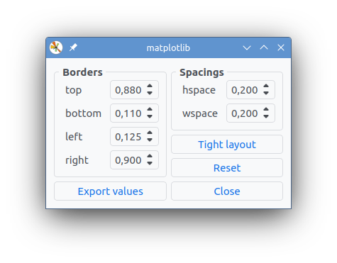
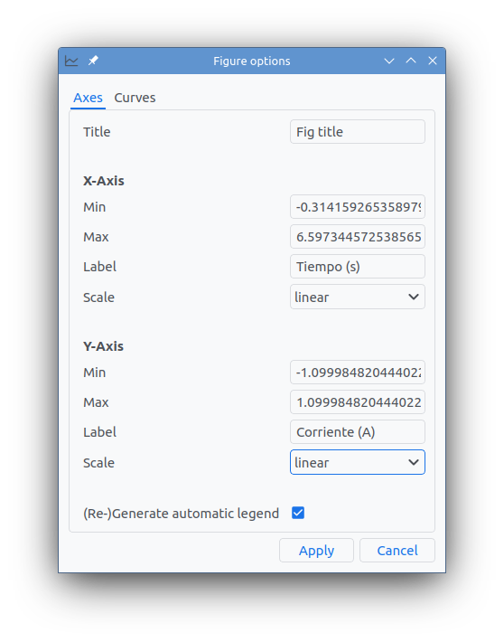

# mpl-modernqt
A modern looking backend for Matplotlib based on the official Qt backend. Its main features are:

* `Phosphor Icons` (monochromatic) thanks to the [QtAwesome](https://github.com/spyder-ide/qtawesome) package.
* Modern theme with the [PyQtDarkTheme](https://github.com/5yutan5/PyQtDarkTheme) package.
* `Qt5` and `Qt6` support.


## Screenshots


<p align = "center">
<i>Matplotlib figure (main window).</i>
</p>


<p align = "center">
<i>Figure settings.</i>
</p>


<p align = "center">
<i>Figure options.</i>
</p>


## Installation
Using ```pip```, the official Python package manager...

On GNU/Linux and MacOS execute the following order in a terminal:
```bash
pip install matplotlib-modernqt -U
```

On MS Windows you may prefer:
```bash
python -m pip matplotlib-modernqt -U
```

## Usage

```python
from matplotlib import use

use('module://mpl_modernqt.backend')
```

## Example code

```python
import numpy as np
from matplotlib import use
import matplotlib.pyplot as plt

use('module://mpl_modernqt.backend')

x = np.linspace(0, 7, 300)
y = np.sin(x)

plt.plot(x, y)
plt.show()
```


## License

This project uses the [MIT license](https://github.com/aloytag/mpl-modernqt/blob/main/LICENSE).
